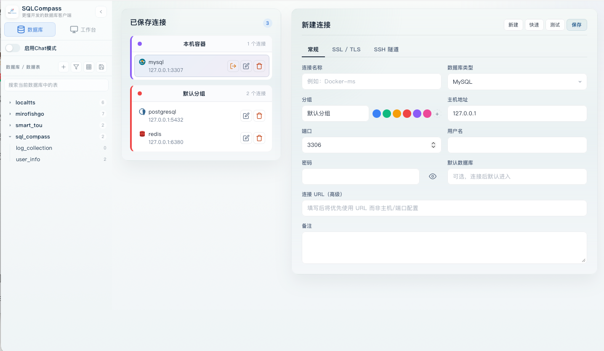
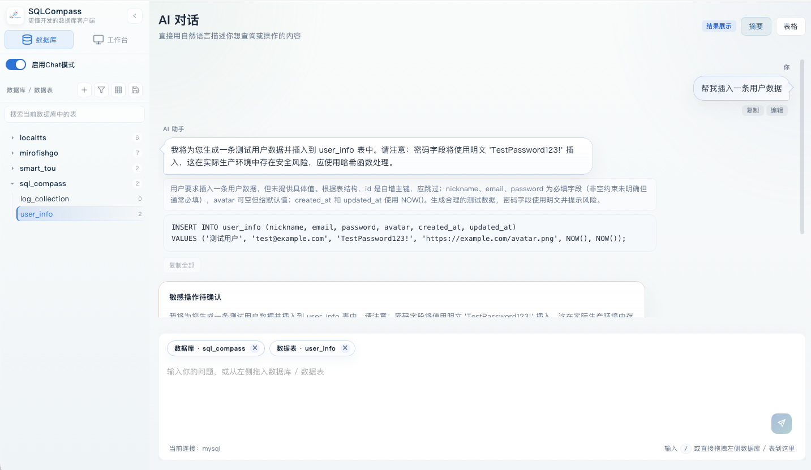
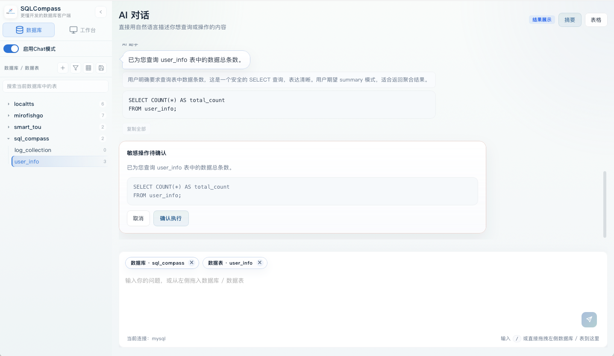
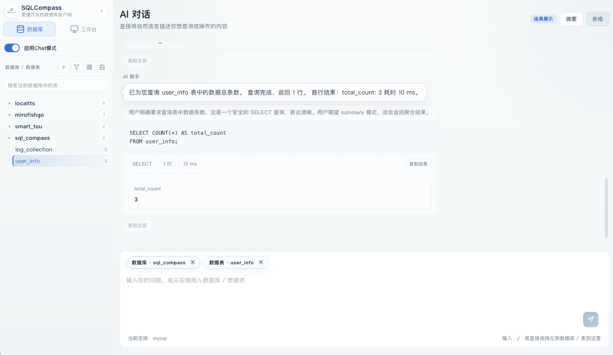
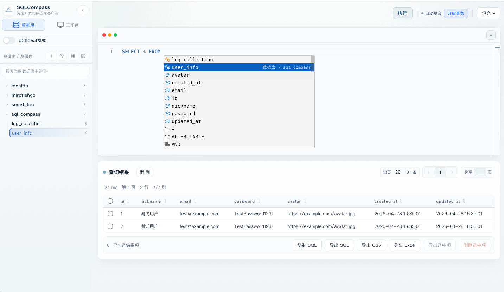
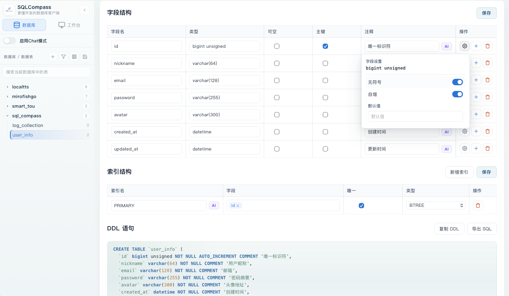
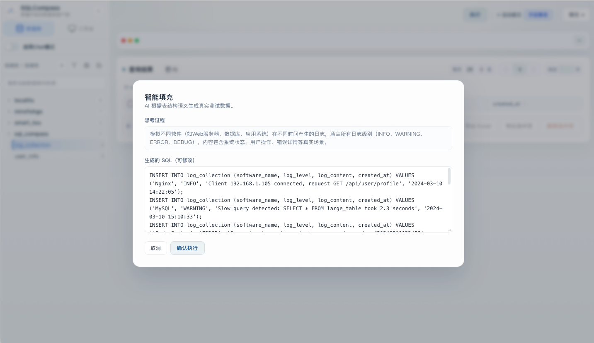
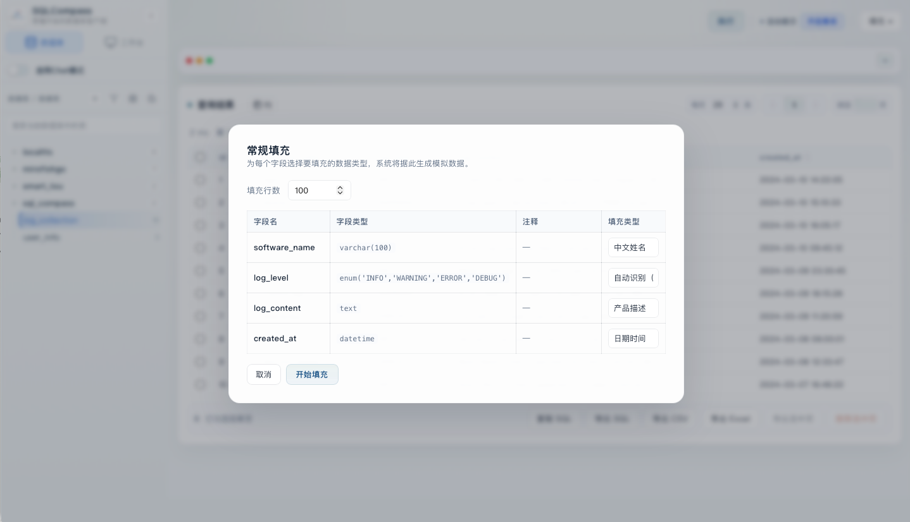
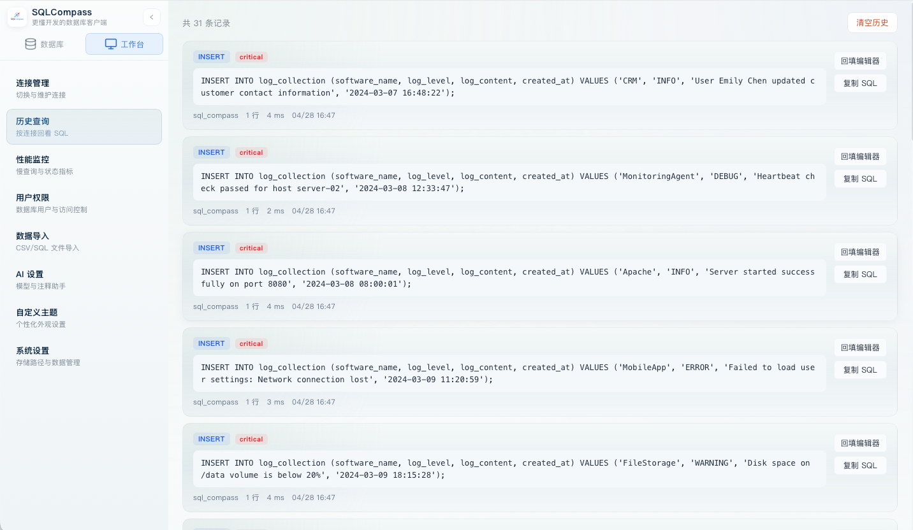

# SQLCompass

A desktop database client built for DBAs and backend developers. Deep integration with MySQL, PostgreSQL, SQLite, ClickHouse, MongoDB, and Redis.



---

## Features

### Multi-Engine Connections
Centralized connection management for all major databases. Automatic engine detection with live connection status.

### AI Copilot
Describe what you need in plain English — SQLCompass generates the query. Includes SQL beautify and auto field comment generation. Every AI-generated statement is previewed before execution.

| Feature | Description |
|---------|-------------|
| Natural Language → SQL | Describe your need, get the query |
| SQL Beautify | Format messy SQL with one click |
| Field Comments | AI analyzes naming and generates comments |







### Select Table Data
Intelligent SQL completion, a simple and elegant SQL editor that supports transactions, imports and exports, and filtering of databases and data tables.



### Visual Table Designer
Design tables visually and preview the exact DDL before it runs. Full support for field types, indexes, character sets, and more.



### Data Import & Export
Import CSV, Excel, or SQL files into your database. Export query results to CSV, Excel, or SQL format. Intelligent filling auto-detects primary keys and sequences.

| Import | Export |
|--------|--------|
| CSV / Excel / SQL file import | Export result grid to CSV / Excel / SQL |
| Intelligent filling (auto-detect PK, sequences) | Normal filling (direct insert) |





### Query History
Every query auto-saved with instant recall.



### Additional Features
- **Query History**: Every query auto-saved with instant recall
- **Dual Themes**: Light and dark mode with one click
- **DDL Preview**: Inspect exact SQL before any structural change runs
- **Safety Guards**: Destructive operations (UPDATE/DELETE) require explicit confirmation

---

## Tech Stack

| Layer | Technology |
|-------|------------|
| Desktop Framework | **Go + Wails v2** |
| Frontend | React 18 + TypeScript + Vite |
| SQL Editor | Monaco Editor |
| Database Drivers | go-sql-driver/mysql, pgx, go-sqlite3, clickhouse-go, mongo-driver, go-redis |

---

## Requirements

- **Go** 1.21+
- **Node.js** 18+
- **npm** or **pnpm**
- macOS / Windows / Linux

---

## Quick Start

### Install Dependencies

```bash
# Frontend
cd frontend && npm install

# Wails CLI (if not installed)
go install github.com/wailsapp/wails/v2/cmd/wails@latest
```

### Development

```bash
# Web preview (no desktop build required)
./start.sh web

# Desktop app with hot reload
./start.sh desktop
```

### Build

```bash
# Build frontend assets
cd frontend && npm run build

# Build desktop application
wails build
```

Build output is in `build/bin/`.

---

## AI Configuration

Connect to SiliconFlow API or any OpenAI-compatible LLM provider.

### Option 1: Environment Variables

```bash
LLM_API_KEY=your_api_key_here
LLM_BASE_URL=https://api.siliconflow.cn/v1
LLM_MODEL_NAME=deepseek-ai/DeepSeek-V3.2
```

### Option 2: In-App Settings

Launch the app → **Settings → AI**. Fill in API Key, Base URL, and Model Name.

---

## Supported Databases

| Database | Connections | Query | Table Designer | AI SQL | Import/Export |
|----------|:-----------:|:-----:|:--------------:|:------:|:-------------:|
| MySQL | ✅ | ✅ | ✅ | ✅ | ✅ |
| PostgreSQL | ✅ | ✅ | ✅ | ✅ | — |
| SQLite | ✅ | ✅ | ✅ | ✅ | — |
| ClickHouse | ✅ | ✅ | — | ✅ | — |
| MongoDB | ✅ | ✅ | — | ✅ | ✅ |
| Redis | ✅ | ✅ | — | — | — |

> ✅ = Fully supported, — = Not yet supported

---

## Project Structure

```
SQLTool/
├── app.go               # Wails application entry
├── main.go              # Program entry point
├── wails.json           # Wails build config
├── internal/            # Go backend
│   ├── ai/              # AI inference
│   ├── database/        # Database drivers
│   ├── history/          # Query history
│   ├── impexp/          # Import/export
│   └── schema/          # Table DDL builder
├── frontend/            # React frontend
│   └── src/
│       ├── components/  # Shared components
│       ├── hooks/       # React hooks
│       ├── pages/       # Page components
│       └── lib/         # Utilities
└── docs/                # Docs and screenshots
```

---

## License

[MIT](./LICENSE)
